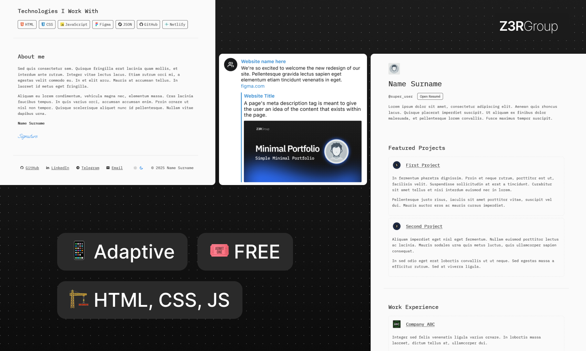

# Simple Developer Portfolio

A minimalist, dev-style portfolio template built with **HTML5, CSS3, and JavaScript (ES6+)**. This project provides a clean and responsive layout to showcase your personal information, tech stack, and work experience.

[](https://app.netlify.com/start/deploy?repository=https://github.com/mxpanf/simple-developer-portfolio)



## 🚀 Features

- **Minimalist Design** - Clean, modern aesthetics.
- **Light & Dark Mode** - Switch themes dynamically.
- **Coders Theme** - Monospaced fonts for a coding-inspired look.
- **Fully Responsive** - Optimized for all screen sizes.
- **Open Graph Integration** - Enhanced social media sharing.
- **Badge Icons** - Skill icons powered by Iconify.

## 📂 Project Structure

```
.
├── 404.html
├── assets
│   ├── avatar.webp
│   ├── companies
│   │   ├── company-1.svg
│   │   └── company-2.svg
│   ├── demo.jpg
│   ├── favicon.ico
│   ├── og-image.jpg
│   └── projects
│       ├── project-1.svg
│       └── project-2.svg
├── index.html
├── script.js
└── style.css
```

## 🛠️ Installation & Setup

### 1. Clone the repository

```sh
git clone https://github.com/mxpanf/simple-developer-portfolio.git
cd simple-developer-portfolio
```

### 2. Open the project

Simply open `index.html` in your browser.

### 3. Customize the project

- **Edit Personal Information** in `index.html`.
- **Fill in META Tags** for SEO and Open Graph.
- **Update Resume Link** in `script.js` within `function openResume()`.
- **Add Skill Badges** in `script.js` under `const badgesData`.

## 🎨 Customization

### Change Theme Colors

Modify `:root` variables in `style.css`:

```css
:root {
  --primary-bg-color: #fafafa;
  --primary-text-color: #333;
  --secondary-bg-color: #f0f0f0;
  --link-color: #333;
  --border-color: #ddd;
  --badge-border-color: #333;
  --signature-color: #0073e6;
  --button-bg-color: transparent;
  --button-text-color: #333;
  --button-border-color: #333;
  --button-hover-bg-color: #f0f0f0;
}
```

### Add or Replace Icons

Icons are powered by **Iconify**. To add new icons:

```html
<span class="iconify" data-icon="devicon:github"></span>
```

Browse more icons at [https://icon-sets.iconify.design](https://icon-sets.iconify.design).

## 🔗 Open Graph Setup

Ensure proper Open Graph settings for better link previews on social platforms:

```html
<meta property="og:title" content="Your Portfolio Title" />
<meta property="og:description" content="Brief description of your portfolio." />
<meta property="og:image" content="assets/og-image.jpg" />
<meta property="og:url" content="https://your-website.com" />
```

## 📜 License

This project is licensed under the **MIT License**. You are free to use, modify, and distribute this code with proper attribution.

## 🤝 Contributing

Contributions are welcome! Feel free to submit a pull request or open an issue.

## 💡 Acknowledgments

Built with ❤️ using **HTML, CSS & JavaScript**.

Inspired by [Mighty Tools](https://mightyalex.com/). Please note that the goal was not to repeat the site, but to make it the way I want it to be.

